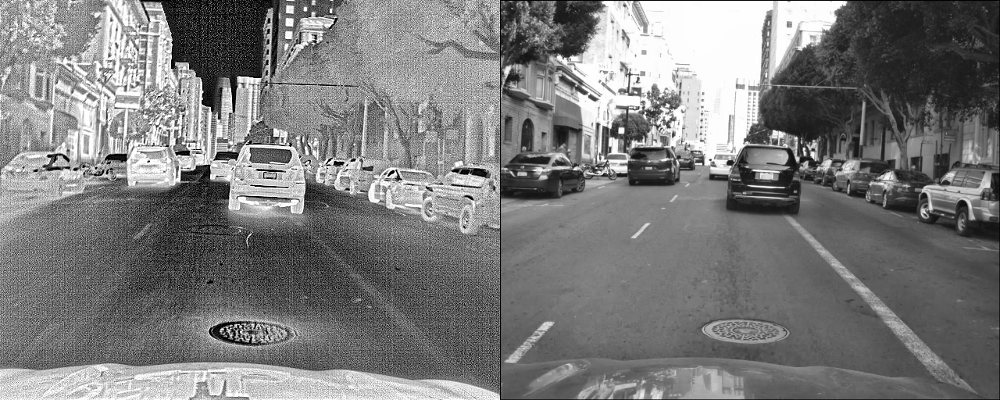
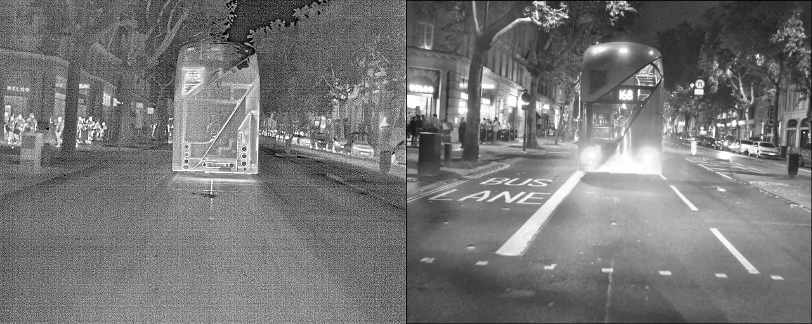
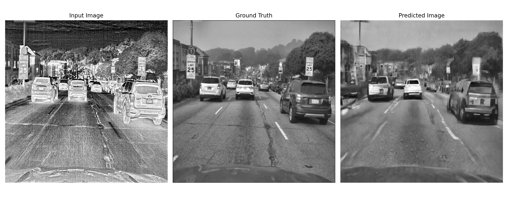
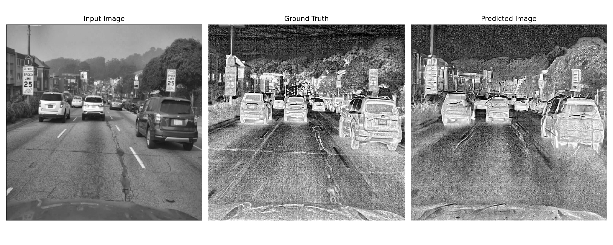
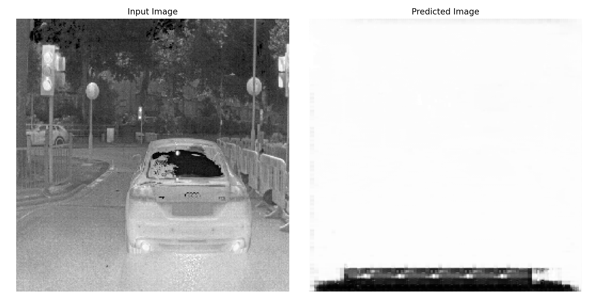

# Table of contents
- [Introduction](#introduction)
- [Quick start](#quick-start)
    - [Requirements](#requirements)
    - [Getting started](#getting-started)
- [Running the code](#running-the-code)
    - [Pix2Pix](#pix2pix)
    - [CycleGAN](#cyclegan)
- [Code structure](#code-structure)
- [GPU cluster](#gpu-cluster)
- [Docker](#docker)
- [Run model using Docker](#run-model-using-docker)
    - [Pix2Pix training example](#pix2pix-training-example)
    - [CycleGAN training example](#cyclegan-training-example)
- [Assessing model quality](#assessing-model-quality)
- [Pix2Pix and CycleGAN](#pix2pix-and-cyclegan)
- [Data](#data)
    - [Training data](#training-data)
    - [Other data](#other-data)
- [Latest results](#latest-results)
    - [Pix2Pix](#pix2pix-results)
    - [CycleGAN](#cyclegan-results)
- [Summary of experiments](#summary-of-experiments)
- [Potential future directions](#potential-future-directions)

# Introduction
The code in this repository aims to develop a conditional generative adversarial network (cGAN) model to convert thermal-spectrum images to the visible spectrum.

This cGAN model will serve as the *first model* in a three-part image classification pipeline of motor vehicle makes and models: 1) images are output from a thermal camera and supplied to the trained cGAN model for conversion to the visible spectrum; 2) the [YOLOv5 algorithm](https://github.com/ultralytics/yolov5) is used on converted visible images to generate bounding box coordinates around any passenger motor vehicles present in the image; 3) images are cropped to the YOLOv5 bounding box area and the make-model of the vehicle is classified using a [second model](https://github.boozallencsn.com/MERGEN/vehicle_make_model_classifier). A mockup of this workflow can be found in the [vehicle_image_pipeline](https://github.boozallencsn.com/MERGEN/vehicle_image_pipeline) repository. The actual image pipeline will be run on an NVIDIA Jetson device and is still in development.

Because of a dearth of adequately-sized, representative labeled thermal images of passenger vehicles, we train the vehicle make-model classifier model using labeled RGB images. For this reason, an upstream model is needed to convert thermal images to the visible spectrum prior to classification. We curate an image training dataset of matched thermal and visible images from [Teledyne FLIR](https://www.flir.com/oem/adas/adas-dataset-form/).

# Quick start
### Requirements
- Linux or macOS (may work on Windows, not tested)
- [ideally] NVIDIA GPU; will also work on CPU

### Getting started
Clone this repository

    git clone git@github.boozallencsn.com:MERGEN/GAN.git

Set up Python virtual environment

    pip install -r requirements.txt

Pull Docker image

    docker pull king0759/tf2_gpu_jupyter_mpl:v3

# Running the code

### Pix2Pix

    python3 pix2pix.py --train/predict --data=<path> --output=<path> [options*]

*See script for options. Requirements differ for train and predict modes

Data is expected in an undifferentiated (i.e. not in 'train', 'val', 'test' subdirectories) directory. The pix2pix script creates random subsets of train/val/test from the images. This script expects a horizontally concatenated image pair ***for both training and predict modes***. By default, the input image is on the left and the target image is on the right. This orientation can be changed by optionally supplying `--input-img-orient='right'`.

Upon execution the script creates a new directory in the output location formatted as `YYYY-MM-DD-HHhmm`, corresponding to the datetime the script was initialized. In training mode, upon the completion the following subdirectories will be present:

- `figs`: loss figures by epoch
- `final_test_imgs`: generated images at the end of training using randomly-selected test images
- `logs`: contains model parameters, a dictionary of training losses by epoch, a dictionary of validation losses by epoch, a log file
- `test_images`: images generated from the first test image at select epochs while training. Useful to see how training the generator progresses
- `training_checkpoints`: contains final model, if the default `--save-weights='true'` is toggled

In predict mode, the script creates the following subdirectories:

- `logs`: contains information on the underlying model used to generate predictions
- `prediction_images`: generated images, organized as inline plots with input, ground truth, and prediction

### CycleGAN

    python3 cycle_gan.py --train/predict --input-images=<path> --output=<path> [options*]

*See script for options. Requirements differ for train and predict modes

As with the pix2pix script, input image data is expected in an undifferentiated directory and random subsets of train/val/test will be created. For predict mode, only the `--input-images` path is required; for training mode, the `--target-images` path is also required. Model output for train and predict modes are the same as for `pix2pix.py`.

# Code structure
Code in this particular branch draws heavily from TensorFlow's excellent tutorials on [Pix2Pix](https://www.tensorflow.org/tutorials/generative/pix2pix) and [CycleGAN](https://www.tensorflow.org/tutorials/generative/cyclegan). The Generator and Discriminator that lie at the heart of these model are nearly identical in TensorFlow's example code. Both models also use several either identical or similar function. We therefore convert these into an abstract base class (ABC Class) in Python.

### Root dir

- [base_gan.py](base_gan.py): ABC superclass containing core methods used by both Pix2Pix and CycleGAN subclasses
- [pix2pix.py](pix2pix.py): contains methods for Pix2Pix subclass
- [cycle_gan.py](cycle_gan.py): contains methods for CycleGAN subclass
- [utils.py](utils.py): contains helper functions for both GAN models
- [requirements.txt](requirements.txt): contains full list of all dependencies used to implement this code
- [README.md](README.md): this script, explains the branch of this repository
- [Docker_Linux_HELPME.md](Docker_Linux_HELPME.md): useful common commands for Docker and Linux
- [driver.sh](driver.sh): shell script to automate the uploading of other scripts in this branch to the GPU cluster

### [create_training_imgs](create_training_imgs)

- [curate_FLIR_data.py](./create_training_imgs/curate_FLIR_data.py): pairs matched thermal and visible images, and aligns these to the overlapping portion of the visible image
- [separate_FLIR_data.py](./create_training_imgs/separate_FLIR_data.py), separates concatenated matched images into child thermal and visible directories

# GPU cluster 
We use Booz Allen's Westborough CSN cluster, which runs has 4 GeForce RTX 2080 Ti GPUs. The UUIDs for these GPUs, which allow runs on specific GPUs, are:

- GPU 0: GPU-8121da2f-b1c3-d231-a9ab-7d6f598ba2dd
- GPU 1: GPU-7a7c102c-5f71-a0fd-2ac0-f45a63c82dc5
- GPU 2: GPU-0c5076b3-fe4a-0cd8-e4b7-71c2037933c0
- GPU 3: GPU-3c51591d-cfdb-f87c-ece8-8dcfdc81e67a

Data are stored on the cluster at:

- `/home/kingj/FLIR_matched_gray_thermal`: concatenated, matched thermal-visible images for Pix2Pix model
- `/home/kingj/FLIR_separated`: separated versions for CycleGAN model

# Docker
We train the GAN models in a Docker container (see [this link](https://docs.docker.com/get-started/overview/) for information on Docker). Also see [Docker_Linux_HELPME.md](Docker_Linux_HELPME.md) for useful Docker and Linux commands. Containers create separate environments from the operating system, so training data and scripts must be moved into the container. Two options exist: create a [Docker volume](https://docs.docker.com/storage/volumes/) (preferred) that persists beyond the life of the container, or mount the data/scripts when the container is instantiated. Directly-mounted data/scripts do not persist beyond the life of the container.

### Data volumes

    FLIR_data_matched       <- concatenated, matched thermal-visible images for Pix2Pix model
    FLIR_data_separated     <- separated versions for CycleGAN model

### Model output volume

    MERGEN_FLIR_output

### Docker image
For this code, as well as the make-model classifier, the following image was used:

    king0759/tf2_gpu_jupyter_mpl:v3

This (admittedly bloated) Docker image contains the packages listed in `requirements.txt`. Not all of the packages listed in this requirements file are strictly necessary for the code in this repository though.

# Run model using Docker

## Pix2Pix training example
    
    docker run -it \
        --name p2p \
        -d --rm \
        --mount type=bind,source=/home/kingj/scripts,target=/scripts \
        --mount source=FLIR_data_matched,target=/data \
        --mount source=MERGEN_FLIR_output,target=/output \
        --gpus device=GPU-3c51591d-cfdb-f87c-ece8-8dcfdc81e67a \
        king0759/tf2_gpu_jupyter_mpl:v3 python3 ./scripts/pix2pix.py \
        --train --data=data --output=output --lambda=100 --epochs=200 \
        --batch-size=8 --logging='true' --save-weights='true'

### Explanation:

- `docker run`: starts a new container
- `-it`: runs the container in interactive mode
- `--name p2p`: specifies the container name as 'p2p', otherwise it'll be given a random one
- `-d`: run the container detached. To work interactively in the container omit this
- `--rm`: removes the container at the end of execution. Note - since output is stored in a volume this persists beyond the life of the container. It's also good practice to remove containers you're not using to reduce HD space
- `--mount type=bind,source=/home/kingj/scripts,target=/scripts`: directly mount the `/home/kingj/scripts` directory, as `/scripts` within the container. Change the source and target directories as needed
- `--mount source=FLIR_data_matched,target=/data`: mounts the previously-created data volume, `FLIR_data_matched` as `/data` within the container
- `--mount source=MERGEN_FLIR_output,target=/output`: mounts the output volume
- `--gpus device=GPU-3c51591d-cfdb-f87c-ece8-8dcfdc81e67a`: Specifies a particular GPU to use. To use all GPUs change this to `--gpus all`
- `king0759/tf2_gpu_jupyter_mpl:v3`: container image. If not stored locally this will be downloaded from Docker Hub
- `python3`: specifies the container should be instantated using Python. To instead instantiate using Bash enter `/bin/bash` or omit entirely (this is the default for this Docker image). Note - the software available in a container depends on the container image
- `./scripts/pix2pix.py --train --data=data --output=output --lambda=100 --epochs=200 --batch-size=8 --logging='true' --save-weights='true'`: instructs the container to run the Pix2Pix script with the supplied arguments. If this is omitted the container will simply instantiate with the default or supplied program (i.e. Python or Bash) and await input

## CycleGAN training example

    docker run -it \
        --name cgan \
        -d --rm \
        --mount type=bind,source=/home/kingj/scripts,target=/scripts \
        --mount source=FLIR_data_separated,target=/data \
        --mount source=MERGEN_FLIR_output,target=/output \
        --gpus device=GPU-0c5076b3-fe4a-0cd8-e4b7-71c2037933c0 \
        king0759/tf2_gpu_jupyter_mpl:v3 python3 ./scripts/cycle_gan.py \
        --train --input-images=data/therm --target-images=data/vis \
        --output=output --save-weights='true' --logging='true' \
        --epochs=50 --img-size=256 --batch-size=16

### Other tips for working interactively:

- `exit`: stops and exits the container. Container may be distroyed if `--rm` flag was used
- `CTRL-c`: force stops operation in container
- `CTRL-p CTRL-q`: escapes the container, though container persists

# Assessing model quality
How do we know if the model is training "well"? The Pix2Pix and CycleGAN models on this branch assess quality in two ways. 

First, we report loss statistics for the validation set by epoch. For Pix2Pix these losses include:
- Generator total loss (i.e. primary + secondary)
- Generator primary loss
- Generator secondary loss (i.e. L1 or SSM) loss
- Discriminator loss

We report some of these in the next section. For the CycleGAN model these losses include: 
- X-Y generator loss
- Y->X generator loss
- Cycle loss
- Total X->Y generator loss (i.e. generator + cycle loss)
- Total Y->X generator loss
- Discriminator X loss
- Discriminator Y loss

However, metrics such as per-pixel squared error fail to evaluate the joint distributions of real and fake images and thus cannot capture the structure that the structured loss attempts to capture ([source](https://arxiv.org/abs/1611.07004)). Outputting a synthesized test image throughout the training process is our second quality assessment. These are found in the output directory in the `test_images` folder with the associated epoch in which they were generated. The full array of test images is also output at the end of training (shown below).

# Pix2Pix and CycleGAN
Originally developed by [Isola et al. (2017)](https://arxiv.org/abs/1611.07004), **Pix2Pix** is a generative adversarial network (GAN) created for general purpose image-to-image translation. As explained by [Jason Brownlee](https://machinelearningmastery.com/how-to-develop-a-pix2pix-gan-for-image-to-image-translation/), "[t]he GAN architecture is comprised of a generator model for outputting new plausible synthetic images, and a discriminator model that classifies images as real (from the dataset) or fake (generated). The discriminator model is updated directly, whereas the generator model is updated via the discriminator model. As such, the two models are trained simultaneously in an adversarial process where the generator seeks to better fool the discriminator and the discriminator seeks to better identify the counterfeit images. The Pix2Pix model is a type of conditional GAN, or cGAN, where the generation of the output image is conditional on an input, in this case, a source image. The discriminator is provided both with a source image and the target image and must determine whether the target is a plausible transformation of the source image. The generator is trained via adversarial loss, which encourages the generator to generate plausible images in the target domain. The generator is also updated via L1 loss measured between the generated image and the expected output image. This additional loss encourages the generator model to create plausible translations of the source image. The Pix2Pix GAN has been demonstrated on a range of image-to-image translation tasks such as converting maps to satellite photographs, black and white photographs to color, and sketches of products to product photographs."

Whereas Pix2Pix relies on *paired images* (i.e. an image in one domain and an aligned matching image in another domain), **CycleGAN** is an image-to-image translation model for *unpaired images*. Developed by [Jun-Yan Zhu et al. (2017)](https://arxiv.org/abs/1703.10593), CycleGAN is advantageous when paired examples don't exist or are challenging to gather. CycleGAN uses the same GAN architecture as Pix2Pix, however, it trains two generators and two discriminators simultaneously. "One generator takes images from the first domain as input and outputs images for the second domain, and the other generator takes images from the second domain as input and generates images for the first domain. Discriminator models are then used to determine how plausible the generated images are and update the generator models accordingly. This extension alone might be enough to generate plausible images in each domain, but not sufficient to generate translations of the input images. [...] The CycleGAN uses an additional extension to the architecture called cycle consistency. This is the idea that an image output by the first generator could be used as input to the second generator and the output of the second generator should match the original image. The reverse is also true: that an output from the second generator can be fed as input to the first generator and the result should match the input to the second generator. Cycle consistency is a concept from machine translation where a phrase translated from English to French should translate from French back to English and be identical to the original phrase. The reverse process should also be true. [...] The CycleGAN encourages cycle consistency by adding an additional loss to measure the difference between the generated output of the second generator and the original image, and the reverse. This acts as a regularization of the generator models, guiding the image generation process in the new domain toward image translation" ([Brownlee 2019](https://machinelearningmastery.com/what-is-cyclegan/)).

# Data
## Training data
We train our GAN models using paired thermal and visible images from [Teledyne FLIR](https://www.flir.com/oem/adas/adas-dataset-form/). FLIR matched images are developed primarily for object detection exercises, as they include object bounding boxes and labels. However, we discard this information as it is not relevant to the current effort. FLIR offers a [free version](https://www.flir.com/oem/adas/adas-dataset-form/) of their matched thermal-visible image data, which comprises 14,452 images taken in and around Santa Barbara, California. We use this dataset and combine it with FLIR's proprietary Europe dataset, which contains 14,353 matched images captured in London, Paris, Madrid, and several other Spanish cities. Both California and European original FLIR images are located on the MERGEN OneDrive Data folder in [FLIR_ADAS_DATASET](https://boozallen.sharepoint.com/:f:/r/sites/MERGEN/Shared%20Documents/Data/FLIR_ADAS_DATASET?csf=1&web=1&e=JVSJGw).

FLIR raw visible (i.e. RGB spectrum) images are 1024h x 1224w pixels, whereas thermal raw images are 512h x 640w pixels. Visible images were produced with a camera with a wider field-of-view and so alignment is necessary for (at least) the Pix2Pix model. The script, [curate_FLIR_data.py](./create_training_imgs/curate_FLIR_data.py), pairs matched thermal and visible images, and aligns these to the overlapping portion of the visible image. Both thermal and RGB images are converted to grayscale (1-channel) and concatenated horizontally with the thermal on the left, visible on the right. *We also preprocess the images; we apply contrast limited adaptive histogram equalization (CLAHE) to locally equalize the dynamic contrast range of both grayscale and thermal images. For the thermal images we additionally apply a gaussian blur filter to reduce pixel noise and sharpen the image. At training time we also apply random cropping to further implement the images*. These data are stored on the MERGEN OneDrive Data folder in [FLIR_matched_grayscale_thermal.zip](https://boozallen.sharepoint.com/:u:/r/sites/MERGEN/Shared%20Documents/Data/FLIR_matched_gray_thermal.zip?csf=1&web=1&e=6e32rH). In some cases, a matched image was not found, or one of the pair was corrupt. Correspondingly, the total number of matched thermal-visible images totals **28,279**. 

The script, [separate_FLIR_data.py](./create_training_imgs/separate_FLIR_data.py), takes as input the concatenated matched images and separates them into child thermal and visible directories. Matched thermal and visible images retain the same file name as the original image for linkage purposes. These are stored on OneDrive's MERGEN Data folder in [FLIR_separated.zip](https://boozallen.sharepoint.com/:u:/r/sites/MERGEN/Shared%20Documents/Data/FLIR_separated.zip?csf=1&web=1&e=xcFcdx). Each curated FLIR image is 512h x 640w pixels (1-channel), which must be resized by both GAN models to 256x256 or 512x512 on read-in.

Below are two paired image examples from the FLIR dataset:

## Other data
Other data have also been previously used in this project. These data were collected by hand during the daytime only in local parking lots around the DC-Maryland-Virginia area and generally feature closely-cropped images of passenger vehicles. The originals of these images are stored on OneDrive in [original_thermal_visible_GAN_images.zip](https://boozallen.sharepoint.com/:u:/r/sites/MERGEN/Shared%20Documents/Data/original_thermal_visible_GAN_images.zip?csf=1&web=1&e=AqeDsd). Concatenated thermal-visible images, not perfectly aligned, are found on OneDrive in [curated_thermal_visible_GAN_images.zip](https://boozallen.sharepoint.com/:u:/r/sites/MERGEN/Shared%20Documents/Data/curated_thermal_visible_GAN_images.zip?csf=1&web=1&e=DGe11H). These images are each 512h x 640w pixels. These are no longer being used in model development.

# Latest results
Unfortunately, neither TensorFlow Pix2Pix nor CycleGAN model contained on this branch have yet demonstrated adequate performance. Several experiments have been run (described below) to bolster model performance. The results below are from the most up-to-date experiments. All results, including weights, can be found [here](https://boozallen.sharepoint.com/:u:/r/sites/MERGEN/Shared%20Documents/ML%20Model%20Results/GAN_model_experiments.zip?csf=1&web=1&e=wQZxga).

## Pix2Pix results
Run on 2022-01-15-18h27. Total training time on one GPU: 60.5 hours. Model parameters:

- Epochs: 150
- Lambda: 100
- Generator loss: L1
- Batch size: 4
- Image size: 512 x 512
- Learning rate: 0.008
- beta_1: 0.9
- beta_2: 0.999
- direction: therm->vis

### Sample image

### Similar results for the reverse

Note: this was run on 2022-01-15-18h26 with otherwise identical parameters.

### Cost functions

## CycleGAN results
Run on 2022-01-05-22h33. Total training time on one GPU 140 hours. Model parameters:

- Epochs: 200
- Lambda: 10
- Batch size: 4 (default=1)
- Image size: 256 x 256
- Learning rate: 2e-4 * batch_size (default=2e-4)
- beta_1: 0.5
- beta_2: 0.999

### Sample image

There's evidence of catastrophic learning failure beyond epoch 35.

### Discriminator cost function X

### Discriminator cost function Y

### Total generator cost function X->Y

### Total generator cost function Y->X

# Summary of experiments
Most experiments have been attempted with the Pix2Pix model as it theoretically held the most promise. This model also trains approx. 4x faster than the CycleGAN model so iterating on experiments is easier.

- Batch size, learning rate and optimizer: the authors of Pix2Pix apparently received the best performance using a batch size of 1 with the Adam optimizer and learning rates of 2e-4, beta_1=0.5, beta_2=0.999. The same was used in both Pix2Pix and CycleGAN TensorFlow tutorials so this was implemented in the current branch's code. Experiments were attempted with batch sizes of 1, 2, 4, and 8 using the same optimizer and learning rate (in hindsight the LR should've been adjusted). Results were all poor
- Optimizer: An experiment was run using SGD with default learning rates and a batch size of 8 using Pix2Pix model. This yielded poor performance
- Lambda: An couple experiments were run varying the default Lambda parameter of the Pix2Pix model from 50 to 150. Results were poor
- SSIM loss: Srini suggested trying the [SSIM](https://www.tensorflow.org/api_docs/python/tf/image/ssim) loss instead of L1 for the generator loss of Pix2Pix. Generated image quality appeared subjectively worse than using L1 based on the default batch size, LR, and optimizer
- Training epochs: The Pix2Pix authors recommend training for 200 epochs. Though we have not run experiments longer than this, validation loss statistics and test image quality do not improve significantly beyond about epoch 50
- Converting visible to thermal: Similar results
- Image preprocessing (e.g. histogram equalization, blurring, sharpening): very slightly improved results
- 512x512 images instead of (256x256): slight image improvement, in exchange for longer training time

# Potential future directions

- Alter image pipeline to identify vehicles in thermal images via YOLOv5, then crop to bounding box around vehicle and run GAN model
- Expand dataset and/or enhance image augmentation
- Add dropout layer(s) since the model seems prone to overfitting
- Focus efforts on other implementations of Pix2Pix/CycleGAN code, e.g. on the `pytorch` branch of this repository built on [Zhu et al.](https://github.com/junyanz/pytorch-CycleGAN-and-pix2pix)
- Apply a Canny or other edge-detection filter on the thermal images at read-in
- Vary patch size since the discriminator in both models relies on a patch GAN architecture
- Visible to thermal using `pytorch` branch
- Revisit using [ThermalGAN](https://github.com/vlkniaz/ThermalGAN). Apparently this was attempted earlier in the MERGEN project though decided against for some reason
- Experiment with [contrastive unpaired translation](https://github.com/taesungp/contrastive-unpaired-translation) model
- Try other non-GAN models. One option would be to develop some kind of convolutional filter akin to [thermal_image_filter](https://github.boozallencsn.com/MERGEN/thermal_image_filter) with two concatenated models: a trainable bottom layer and an untrainable make-model classifier top layer. Weight updates would generate a CNN filter that maximizes the probability a vehicle is correctly classified. Srini’s SSIM models apparently works somewhat like this